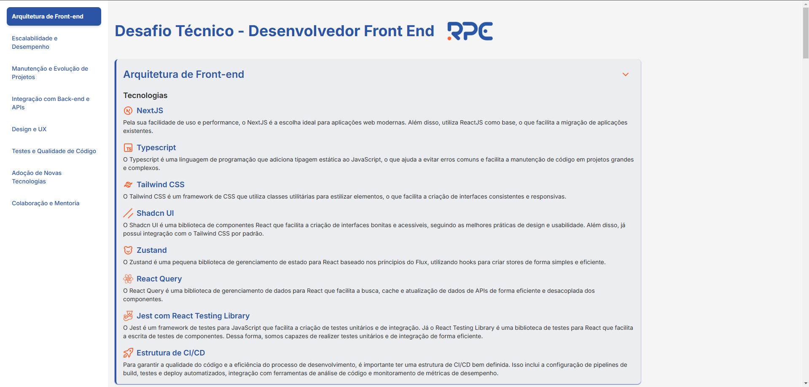

# RPE Tech Front-End Challenge

Este projeto foi desenvolvido como parte do desafio para a vaga de Desenvolvedor Front-End na **RPE Tech**.

## Objetivo do Desafio

O desafio consiste em responder 8 perguntas que avaliam:

- A capacidade de analisar criticamente cenários.
- Tomar decisões técnicas eficazes.
- Comunicar adequadamente escolhas e direcionamentos relacionados ao projeto e à implementação de aplicações front-end.

Para apresentar as respostas de forma organizada e interativa, criei um site funcional que pode ser acessado em:  
**[rpe-tech-challenge.vercel.app](https://rpe-tech-challenge.vercel.app/)**

---

## Tecnologias Utilizadas

- **React** com **Next.js**: Para criação do front-end moderno e otimizado.
- **TailwindCSS**: Para estilização rápida, flexível e responsiva.
- **TypeScript**: Para garantir maior segurança e robustez no desenvolvimento.
- **Vercel**: Utilizada para realizar o deploy contínuo com integração ao GitHub
- **NPM**: Gerenciador de pacotes utilizado

---

## Estrutura do Projeto

```bash
├── README.md
├── eslint.config.mjs
├── next-env.d.ts
├── next.config.ts
├── package-lock.json
├── package.json
├── postcss.config.mjs
├── public # Pasta que contém os assets utilizados
├── src
│   ├── app # App Folder do NextJS
│   │   ├── favicon.ico # Favicon da aplicação
│   │   ├── globals.css # Arquivo de configurações globais do CSS
│   │   ├── layout.tsx # Layout global da aplicação
│   │   └── page.tsx # Página principal (/)
│   ├── components # Pasta com os componentes utilizados na aplicação
│   ├── data # Pasta com dados estáticos. Nesse caso, as questões
│   ├── hooks # Pasta para hooks customizados.
│   └── utils # Pasta para funções utilitárias
├── tailwind.config.ts # Configuração do TailwindCSS
└── tsconfig.json
```

---

## Como Executar Localmente

Se desejar executar o projeto localmente, siga os passos abaixo:

1. Clone este repositório:
   ```bash
   git clone git@github.com:valderyjr/rpe-tech-challenge.git
   ```
2. Acesse o diretório do projeto:
   ```bash
   cd rpe-tech-challenge
   ```
3. Instale as dependências:
   ```bash
   npm install
   ```
4. Inicie o servidor de desenvolvimento:
   ```bash
   npm run dev
   ```
5. Acesse o projeto no navegador:
   ```
   http://localhost:3000
   ```

---

## Imagem da aplicação



---

## Considerações Finais

O site foi projetado como uma forma de demonstrar minha capacidade de desenvolver aplicações front-end modernas, bem como para apresentar minhas decisões técnicas de forma clara. Caso tenha dúvidas ou sugestões, estou à disposição!
